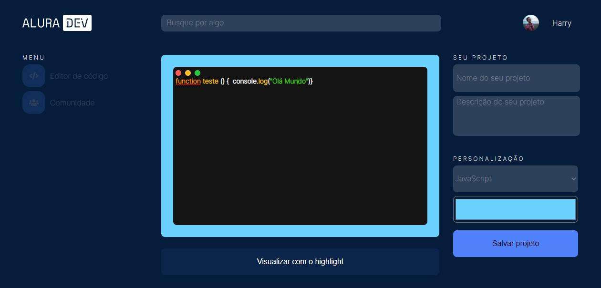
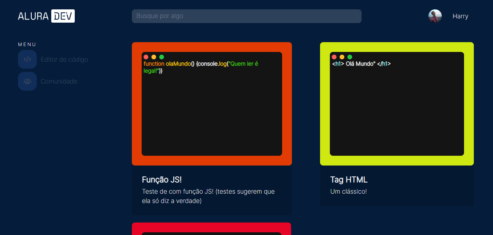

# Editor de código - Alura Dev

Alura Dev é um editor de código para você criar, guardar e compartilhar imagens do seu código.
Seu projeto pode ser salvo na aba Comunidade!

Acesse o Alura Dev atravéz do [link](https://felipewanner.github.io/editor-codigo/)

## Índice: 

* 👉 [Como utilizar o editor](#Como-utilizar-o-editor) 
* 👉 [Como rodar o projeto](#Como-rodar-o-projeto) 
* 👉 [Screenshot](#Screenshot) 
* 👉 [O que é o Alura Challenge?](#O-que-é-o-Alura-Challenge)
* 👉 [Tecnologias utilizadas](#Tecnologias-utilizadas)
* 👉 [Ainda não é o fim!](#Ainda-não-é-o-fim)

## Como utilizar o editor:

* Abra o link acima, e no editor, você poderá digitar o seu código em HTML, CSS ou JavaScript.

* Depois, na aba "SEU PROJETO", dê um nome para o projeto e uma descrição.

* Na aba "PERSONALIZAÇÃO" você deverá selecionar a linguagem utilizada no editor e a cor que deseja para a moldura
(Caso queira visualizar o highlight do editor na linguagem selecionada, pressione "Visualizar com o highlight").

* Por fim, salve o seu projeto, clicando no botão "Salvar projeto". Todos os projetos salvos são encontrados no Botão "Comunidade" do menu.

* LEMBRE-SE: Por enquanto, os projetos ficam salvos apenas no localStorage do seu navegador, isso significa que os projetos não ficam salvos caso o navegador seja fechado e reaberto 🙄

## Como rodar o projeto:

Primeiro será necessário clonar o projeto com `git clone https://github.com/FelipeWanner/editor-codigo.git`.
Depois de clonar o repositório, você pode rodar o projeto localmente de 2 formas: 

  1ª: Abra seu navegador, e pressione `ctrl + O`, encontre a pasta que salvou o projeto e abra o arquivo "index.html" na pasta root do projeto.

  2ª: Se o seu editor de texto for o [Visual Studio Code](https://code.visualstudio.com/), baixe a extensão [Live Server](https://marketplace.visualstudio.com/items?itemName=ritwickdey.LiveServer), abra o arquivo "index.html" da pasta root no seu VSCode e clique em "live-server".

## Screenshot

<h2>O que é o Alura Challenge?</h2>

Este projeto surgiu através do Alura Challenge - Edição Front-End.
A ideia deste challenge é preparar o aluno para o mercado de trabalho, ao desafiar a criação da parte front-end de um site, utilizando as ferramentas clássicas do front-end como HTML, CSS e JS.
Mas não apenas isso, durante o challenge, os alunos tiveram que utilizar outras ferramentas, como o [Trello](https://trello.com/b/19ouy4RA/desafio-front-end-semana-1), [Figma](https://www.figma.com/file/Ve4hpTfmMa7yAFneoGtGKD/Alura-Challenge---Edi%C3%A7%C3%A3o-Front-end?node-id=207%3A729&viewport=86%2C-1148%2C0.3736729025840759) e reuniões com os colegas através do Discord.

<h2>Tecnologias utilizadas:</h2>

* HTML5
* CSS3
* JavaScript

* [Highlight.js](https://highlightjs.org/): Biblioteca JS responsável por aplicar o highlight ao editor!

<h3>Ainda não é o fim!</h3> 

Ainda pretendo alterar o projeto e adicionar novas features, como: 

* O perfil do usuário ser dinâmico (nada contra o Harry!), podendo até linkar o perfil do git-hub.
* Adicionar algum banco de dados e de fato armazenar os cards.
* Barra de pesquisa servir para pesquisar cards.
* Ativar os likes e comentários.
* Poder excluir os cards.